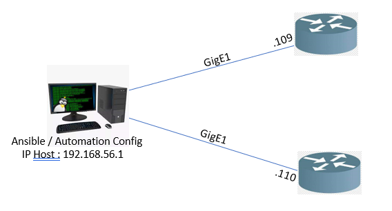

# Topik : Basic Config and Backup data small network with automation using ansible

### Nama   : Hasrat Bahari Lafau
### Mentor : 
### 1. Angga Friyanto
### 2. Ika Candradewi
### Program : Network Programmability - Kelas A 
 

Topology config small-network with ansible

Link Youtube : https://youtu.be/DGJdGX-l8vQ